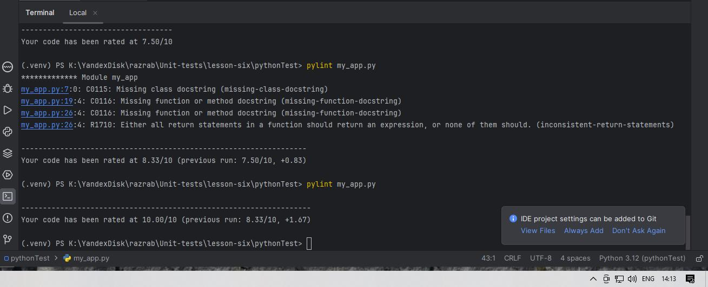
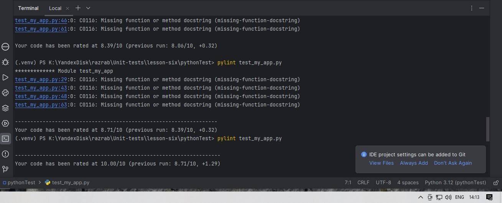
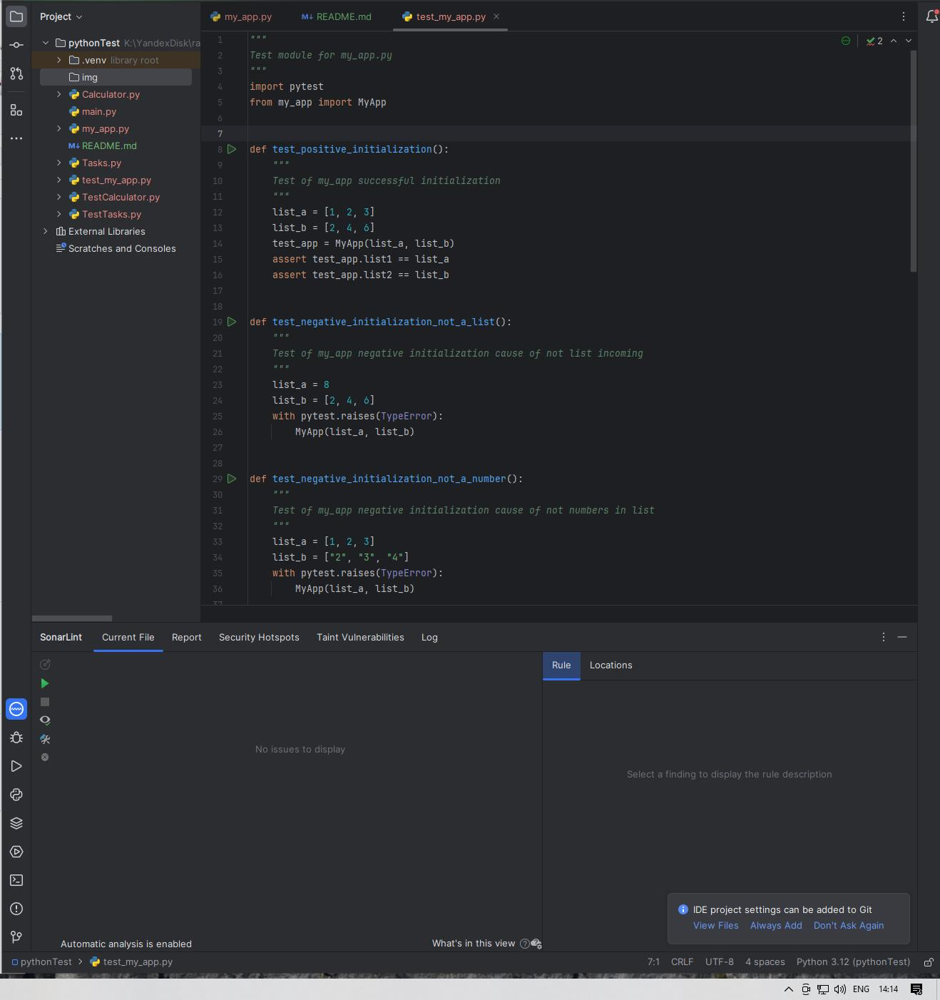

Тестами test_my_app.py покрыто: 
1. Инициализация приложения MyApp:
- передача двух валидных списков чисел
- передача вместо списка одного числа
- передача списка не чисел
2. Расчет среднего значения каждого списка:
- передача разных валидных списков
- передача пустого списка, который вызывает деление на ноль
3. Сравнение средних двух списков в разных сценариях:
- средняя первого списка больше
- средняя второго списка больше
- средние списков равны

Отчет pylint о коде приложения

Отчет pylint о коде тестов

Отчет SonarLint о коде тестов

Отчет о покрытии тестами в PyCharm Community сделать не могу.